---
format:
  revealjs: 
    touch: true
    slide-number: false
    chalkboard: true
    embed-resources: false
    # footer: "<a href=\"../index.html\">Back to section</a>"
    preview-links: auto
    width: 1500
    transition: slide
    favicon: img/auaicon.ico
    logo: img/auaicon.ico
    fig-align: center
    css: styles.css
    include-in-header:
      - text: |
          <link rel="stylesheet" href="https://cdnjs.cloudflare.com/ajax/libs/font-awesome/6.5.0/css/all.min.css">
          <style>
            .icon-xxl { font-size: 84px; }
            .icon-xl  { font-size: 64px; }
            .icon-lg  { font-size: 48px; }
            .muted { opacity: .8 }
            .pill { border-radius: 10px; }
            .circle { border-radius: 50%; }
          </style>
---

# Group Project


## Scope {.smaller}

- Finding a Marketing related problem
- Understanding the methodology of the analysis
- Create a product using microservice architecture:
    - Predictive Model (component)
    - DB
    - Data Processing pipeline (if needed)
    - Backend
    - Frontend (only for the groups with 5 members)
- Add documentation 


## Team

- **Product/Project Manager:** team sync, product research
- **DB Developer:** responsible for the database development
- **Data Scientist/Analyst:** responsible for Modeling and EDA
- **Backend Developer:** responsible for the API
- **Frontend Developer:** responsible for the layout of the product

>I will be the requestor

## Flow


## Architecture


## Teamwork

*"If you want to go fast, go alone. If you want to go far, go together."*

<!-- todo add PAUSE here -->


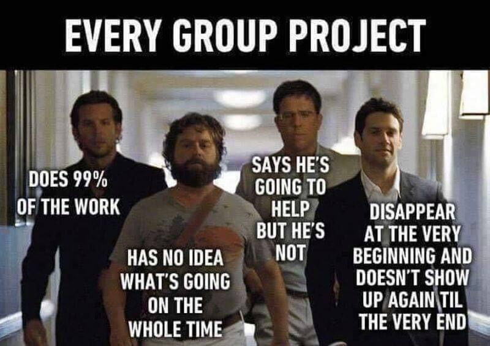

#   Product Manager

## Responsibilities

**Product Manager** is responsible for the product roadmap.

1. Define a product
2. Define MVP
3. Manage Stakeholders: 
    - Communicate with me and Artur 
    - Team Sync
4. Follow-up tasks
5. Build low fidelity mockup (expand the above flowchart) 
6. Manage `pull requests`


## Tools


You are going to use  *Github Projects*. Throughout the lectures/sessions you will learn more.
 

## Prioritization

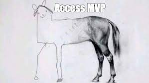{width=100%}


## MoSCoW

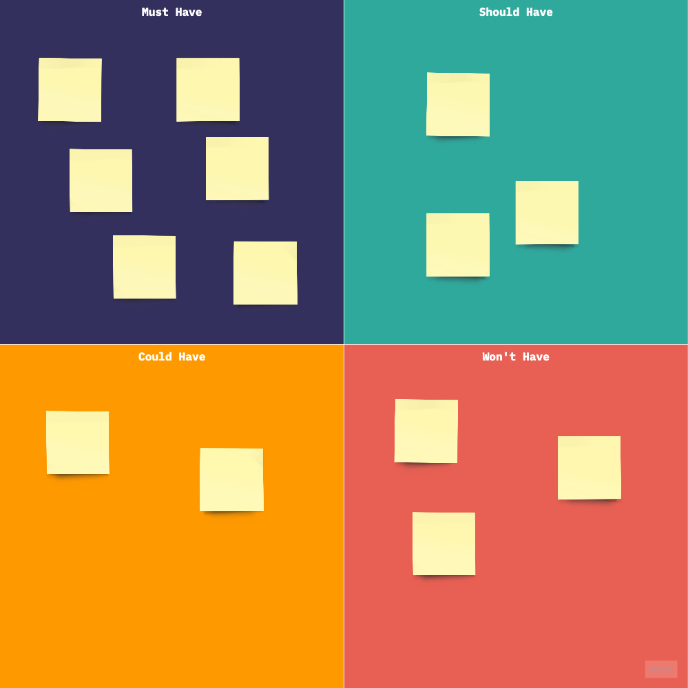{width=100%}

## MVP


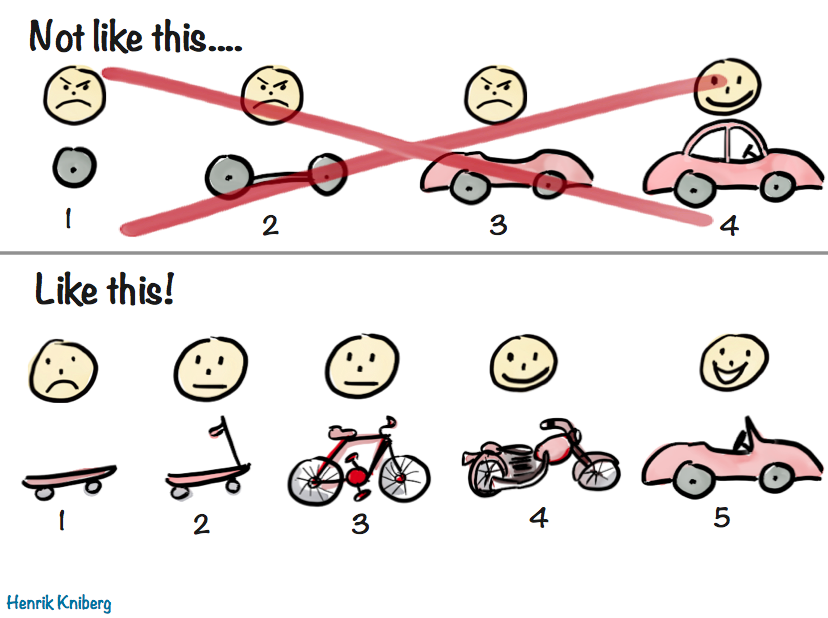


# Roadmap

## Roadmap

Project starts on `01-Apr-2026` and  ends on `14-May-2026`. Thus, we have a little bit more than a months to complete the project.

{width=100%}


## Tasks {.smaller}

After building the roadmap, teams should break down each block into tasks. 

For the sake of simplicity, we can use the following flow:

$${Backlog \rightarrow WIP \rightarrow Review \rightarrow Done}$$


1. **Backlog:** filling in  all the tasks according to the roadmap
2. **WIP:** work in process:
    + Following up the status of the tasks
    + Discuss in the comments in case of issues. Feel free to add me and/or Artur in the discussion.
3. **Review:** checking whether the task is completed correctly
4. **Done**
 
    

# Database Developer

## Responsibilities

**The Database Developer is responsible for:**

- designing database
- building the tables
- create functionality to interact with Python(CRUD and not only )

# Backend Developer

## Responsibilities

A Backend Developer is responsible to develop multiple endpoints according to the business logic.
Our recommendation is to use **FastAPI**:

- it is really fast!
- the easiest one to learn
- has integrated swagger (API documentation)
- critical for Data Scientists, as it enables them to build and deploy end-to-end Data Science and AI applications


# Frontend Developer

## Responsibilities

The Front-End Developer will be responsible for building a user-friendly interface for presenting the results and insights by collaborating with other team members (such as the data scientist, Backend developer, and database developer) to integrate data models, APIs, and visualizations into a cohesive, interactive web application.


## Why Streamlit? {.smaller}

- **Quick Development:** Streamlit simplifies the process of turning Python scripts into interactive web applications, making it a great choice for a fast-paced group project where quick prototyping and iteration are important.
- **No Need for Front-End Knowledge:** developers don’t need extensive knowledge of web technologies like JavaScript, making it easier for data scientists or Python developers to create visually appealing apps.
- **Real-Time Interaction:**  supports interactive widgets like sliders, forms, and buttons that allow users to explore data models and see the impact of different parameters in real-time, which is valuable in marketing analytics projects (e.g., interactive A/B testing visualizations or customer segmentation insights).
- **Visualization Support:**  works seamlessly with popular data visualization libraries such as  `*Seaborn*`, and `*Plotly*`, which can be useful for displaying complex marketing analytics results like clustering or survival analysis 

# Data Analyst/Scientist 

## Responsibilities

A data professional is responsible for the pipeline of predictive and/or analytical parts.

**Data Scientist should provide below objects:**

- Data generation (if needed)
- Model building 
- Model(s) evaluation
- Performance metric
- Depending on the project, the Data Scinetist would be responsible for:
  - Deploying the model as an API (if needed)
  - Storying model results in the database (if needed)


# Milestones


## Construct Groups


Considering the complexity of a group project, we must start doing it as soon as possible! (not until the **1st of November!**)


## Milestones

We are going to have 4 **graded** milestones to complete the project. 

Group Project Grade will be allocated to milestones, with the below weights:


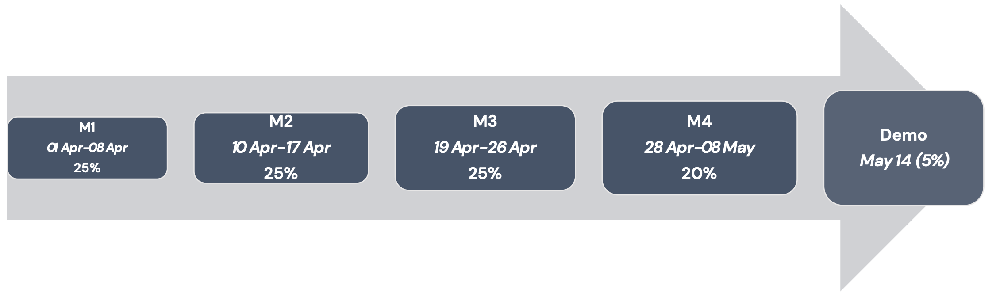

## Milestone 1 | 1 Apr - Apr 08 {.smaller}

::: {.incremental}

1. Problem Definition (you can learn more about it  [here](https://docs.google.com/document/d/1uUp4Kpduj768tGjAxXGiGrUesQiYIenQoSLlVpRHqpA/edit?usp=drive_link))
2. Finalizing roles [here](https://docs.google.com/spreadsheets/d/1TyMjzzwjN9CZi7VKYZqxUSrDiOfUeaLpuWlcDpUZ8jk/edit#gid=0)
3. Schedule a call/meeting with me and Artur
4. Find your Repository and join
5. Create a product roadmap and prioritized functionality (items)
6. Join the respecitve Repository in the Github Organization (you will be invited to join the organization, please accept the invitation and join the repository) ^[A footnote]
7. Push *point 1, point 4, point 6 (requirements.txt).*
8. Prototype/Flowchart the UI using ChatGPT or any other tool (Figma, Miro, etc.)
9. Create a private Slack channel in **OUR** Workspace and name it **Group {number}**
10. Install VsCode (also install Project Manager extension)

:::

::: aside

:::

# Environment


## Objective

- **Docker:** intuition  
- Schema Design  
- Data Generation  
- Data Ingestion  

---

## Dockerized Environment: 1

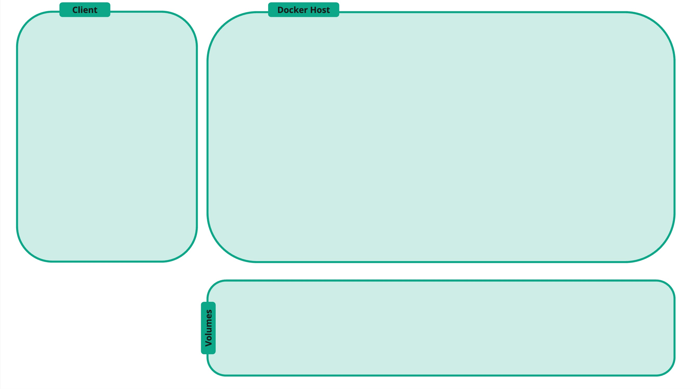{.plain height=500px}

---

## Dockerized Environment: 2

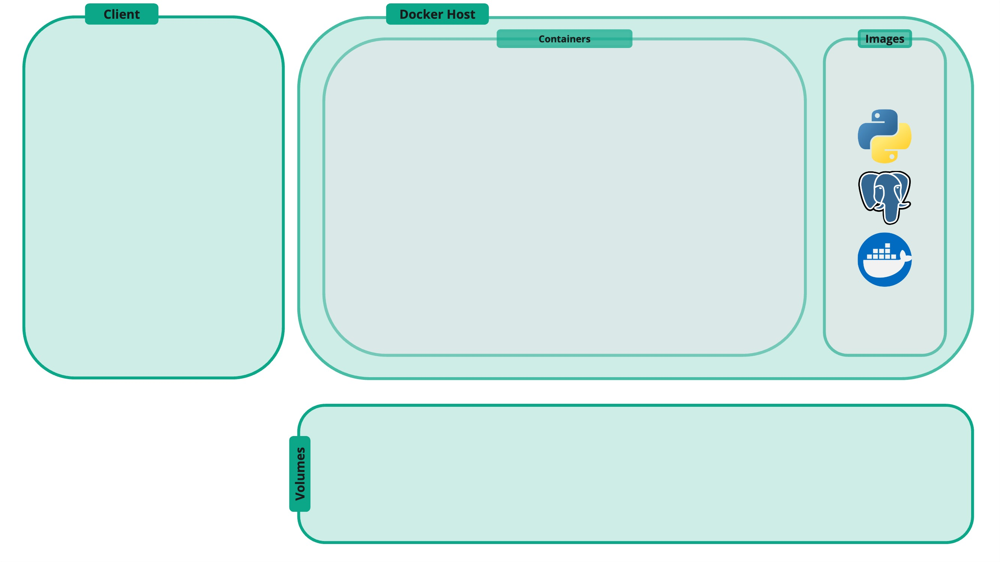{.plain height=500px}

---

## Dockerized Environment: 3

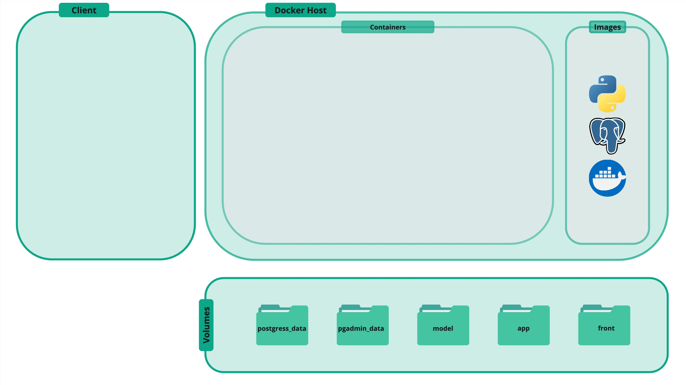{.plain height=500px}

---

## Dockerized Environment: 4

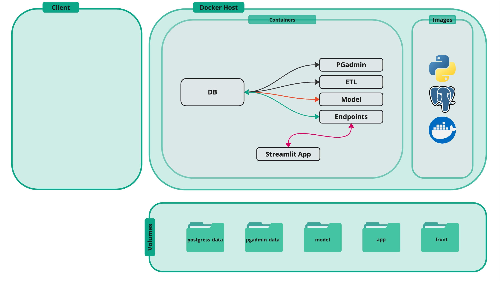{.plain height=500px}

---

## Dockerized Environment: 5

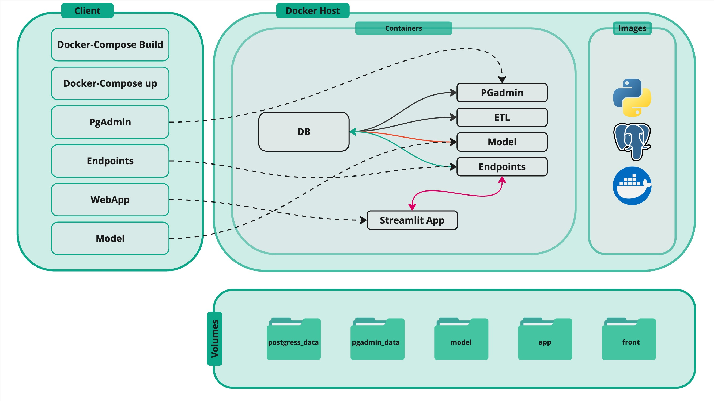{.plain height=500px}

---

## Dockerized Environment: We Need

{.plain height=500px}

---

## For Today...

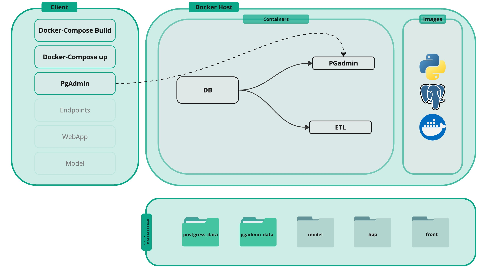{.plain height=500px}


## Docker Files {.smaller}

```yaml
FROM python:3.10-slim-bullseye

RUN apt-get update && apt-get install -y \
    build-essential libpq-dev libfreetype6-dev libpng-dev libjpeg-dev \
    libblas-dev liblapack-dev gfortran \
    && rm -rf /var/lib/apt/lists/*

# Set working directory
WORKDIR /etl

# Copy requirements file and install dependencies
COPY requirements.txt requirements.txt 
RUN pip3 install --upgrade pip
RUN pip3 install -r requirements.txt

# Copy the rest of the application code
COPY . .

# Expose port 3000
EXPOSE 3000

# Command to run the python file
CMD ["python", "etl.py"]
```

## Docker-Files {.smaller}

```yaml
services:
    db:
        container_name: postgresql_db
        image: postgres
        restart: always
        ports:
        - 5432:5432
        environment: 
        - POSTGRES_USER=${DB_USER}
        - POSTGRES_PASSWORD=${DB_PASSWORD}
        - POSTGRES_DB=${DB_NAME}
        volumes:
        - ./postgres_data:/var/lib/postgresql/data #persisting data                           
    pgadmin:  
        container_name: pgadmin
        image: dpage/pgadmin4
        environment:
        - PGADMIN_DEFAULT_EMAIL=${PGADMIN_EMAIL}
        - PGADMIN_DEFAULT_PASSWORD=${PGADMIN_PASSWORD}
        ports:
        - 5050:80 # for local browser (80 is the default port of the browsed)
        volumes:
        - ./pgadmin_data:/var/lib/pgadmin  # Persisting pgAdmin configuration and sessions
        depends_on: 
        - db
    etl:
        container_name: etl
        build: ./etl
        ports:
        - 3000:3000
        volumes:
            - ./etl:/etl
        depends_on: 
        - db
```

## Execution

```yaml
docker-compose up
```


# Milestone 2


## Switch to M2 branch

```{bash}
git checkout -b m2
```

```{bash}
git pull
```

## 

<!-- 1. Decide the endpoints (the actions that your product is going to include) -->
<!-- 1. DB developer: Design the database using Star or any other schema (provide ERD) -->
<!-- 2. DB developer: Insert Sample to data -->
<!-- 2. DB developer: Insert Sample to data -->
<!-- 3. Data Scientist: -->
<!--     - Select data from DB -->
<!--     - Insert data to DB -->
<!--     - Call objects from your module -->
<!-- 4. API developer: -->
<!--     - Select data from DB -->
<!--     - Insert data to DB -->
<!--     - Update data in DB -->
<!-- 7. Complete the second chapter of   [\textcolor{blue}{Developing Python Packages}](https://app.datacamp.com/learn/courses/developing-python-packages) -->


<!-- ## Milestone 3 | 08Apr-20Apr -->

<!-- 7. Complete the third chapter of  [\textcolor{blue}{Developing Python Packages}](https://app.datacamp.com/learn/courses/developing-python-packages) -->
<!-- 6. -->

<!-- ## Milestone 4 | 22Apr-04May -->

<!-- 7. Complete the third chapter of   [\textcolor{blue}{Developing Python Packages}](https://app.datacamp.com/learn/courses/developing-python-packages) -->
<!-- 6. Finish documentation -->

